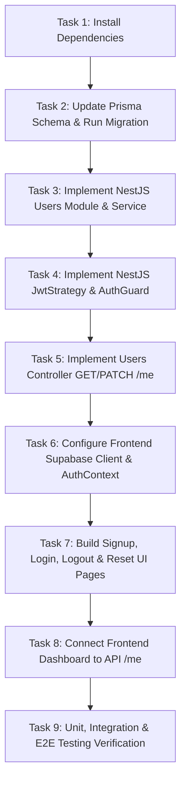

# MINSTOCS CRM

# PHASE 2 — IMPLEMENTATION PLAN: AUTHENTICATION & IDENTITY

> **Version:** 1.0  
> **Status:** PROPOSED PLAN (Awaiting Explicit User Authorization)  
> **Target Duration:** Phase 2 Execution  
> **Authoritative Basis:** `docs/00-MASTER-SPEC.md`, `docs/13-PHASE-2-SPEC.md`, `docs/02-ARCHITECTURE.md`, `docs/05-DATABASE-SPEC.md`, `docs/06-API-SPEC.md`, `docs/07-SECURITY-SPEC.md`, `docs/08-FRONTEND-SPEC.md`

---

## 1. Phase 2 Implementation Objective

Establish production-grade authentication and identity management for MINSTOCS CRM without implementing CRM business functionality. 

Phase 2 provides:
- User signup, login, and logout via **Supabase Auth**
- Session management & access token validation in **NestJS API**
- Application identity persistence (`User` model) in **PostgreSQL via Prisma**
- Current authenticated user lookup/sync endpoint (`GET /api/v1/users/me`, `POST /api/v1/users/sync`)
- Password reset and email verification flows
- Authentication guards (`AuthGuard`) protecting NestJS endpoints
- Authentication-aware Next.js frontend state & protected layout routes

---

## 2. Current Verified Repository State

| Component | Status | Details |
|---|---|---|
| **Monorepo Foundation** | ✅ Verified | pnpm workspace + Turborepo (`@minstocs/api`, `@minstocs/web`) |
| **Backend Framework** | ✅ Verified | NestJS v11 API at `apps/api` |
| **Frontend Framework** | ✅ Verified | Next.js v15 App Router at `apps/web` |
| **Database Connection** | ✅ Verified | Supabase PostgreSQL active (`DATABASE_URL` & `DIRECT_URL` configured in `apps/api/.env`) |
| **Database Schema** | ✅ Verified | Intentionally empty (`schema.prisma` contains zero models) |
| **Existing Dependencies** | Inspected | `@nestjs/jwt`, `@nestjs/passport`, `passport-jwt`, `@supabase/supabase-js`, `@supabase/ssr` are **NOT YET INSTALLED** |

---

## 3. Prerequisites & Package Dependencies

Before implementing code, the following dependencies will be installed:

### 3.1 Backend Dependencies (`apps/api`)
- `dependencies`: `@nestjs/passport`, `passport`, `passport-jwt`, `@supabase/supabase-js`
- `devDependencies`: `@types/passport-jwt`

### 3.2 Frontend Dependencies (`apps/web`)
- `dependencies`: `@supabase/supabase-js`, `@supabase/ssr`

### 3.3 Environment Configuration (`apps/api/.env` & `apps/web/.env.local`)
- `NEXT_PUBLIC_SUPABASE_URL`: Supabase project URL
- `NEXT_PUBLIC_SUPABASE_ANON_KEY`: Supabase anon key
- `SUPABASE_JWT_SECRET`: Supabase JWT secret for backend verification

---

## 4. Database Schema Changes & Migration Strategy

### 4.1 Prisma Schema Specification (`apps/api/prisma/schema.prisma`)
Add the authoritative `User` model as specified in `docs/13-PHASE-2-SPEC.md`:

```prisma
model User {
  id        String   @id @db.Uuid
  email     String   @unique
  firstName String?
  lastName  String?
  avatarUrl String?
  isActive  Boolean  @default(true)
  createdAt DateTime @default(now())
  updatedAt DateTime @updatedAt

  @@map("users")
}
```

### 4.2 Migration Execution
- **Command**: `pnpm --filter @minstocs/api exec prisma migrate dev --name init_users_table`
- **Verification**: Verify migration SQL creates `public.users` with `id UUID PRIMARY KEY` matching `auth.users.id`.
- **Client Generation**: Run `pnpm --filter @minstocs/api prisma:generate`.

---

## 5. Backend Authentication Architecture (`apps/api`)

### 5.1 NestJS Auth Module & JWT Guard Strategy
1. **`JwtStrategy` (`apps/api/src/auth/strategies/jwt.strategy.ts`)**:
   - Extends `PassportStrategy(Strategy)` from `passport-jwt`.
   - Extracts Bearer token from `Authorization: Bearer <token>` header.
   - Verifies signature using `SUPABASE_JWT_SECRET`.
   - Validates `sub` claim (Supabase Auth user UUID) and `email`.

2. **`AuthGuard` (`apps/api/src/auth/guards/jwt-auth.guard.ts`)**:
   - Extends NestJS `AuthGuard('jwt')`.
   - Attaches authenticated user payload to `request.user`.

3. **User Synchronization Service (`apps/api/src/users/users.service.ts`)**:
   - `findOrCreateFromSupabase(supaUser: { id: string; email: string })`: Looks up `User` by `id`. If not found, creates `User` record in PostgreSQL using `id = supaUser.id` and `email = supaUser.email`.

### 5.2 Required API Endpoints & DTOs

| Endpoint | Method | Guard | Description |
|---|---|---|---|
| `/api/v1/users/me` | `GET` | `JwtAuthGuard` | Returns current application `User` profile |
| `/api/v1/users/me` | `PATCH` | `JwtAuthGuard` | Updates `firstName`, `lastName`, `avatarUrl` |
| `/api/v1/users/sync` | `POST` | `JwtAuthGuard` | JIT synchronizes Supabase identity to `public.users` |

#### DTOs & Validation:
- `UpdateUserProfileDto`:
  - `firstName`: `@IsOptional() @IsString() @MaxLength(50)`
  - `lastName`: `@IsOptional() @IsString() @MaxLength(50)`
  - `avatarUrl`: `@IsOptional() @IsUrl()`

---

## 6. Frontend Authentication Architecture (`apps/web`)

### 6.1 Supabase Browser & SSR Client Setup
- `apps/web/src/lib/supabase/client.ts`: Instantiates browser Supabase client using `@supabase/ssr` or `@supabase/supabase-js`.
- `apps/web/src/lib/supabase/server.ts`: Instantiates server Supabase client for SSR/middleware.

### 6.2 Frontend Auth Context & State Management
- `apps/web/src/context/auth-context.tsx`: Provides `user`, `session`, `loading`, `login()`, `signup()`, `logout()`, `resetPassword()`.
- Listen to `supabase.auth.onAuthStateChange()`.
- On login / session refresh, attach access token to API calls (`Authorization: Bearer <token>`).

### 6.3 Frontend Pages & UI Components
- `/auth/signup` (`apps/web/src/app/auth/signup/page.tsx`): User registration form (email, password).
- `/auth/login` (`apps/web/src/app/auth/login/page.tsx`): User sign-in form (email, password).
- `/auth/forgot-password` (`apps/web/src/app/auth/forgot-password/page.tsx`): Password reset request form.
- `/dashboard` (`apps/web/src/app/dashboard/page.tsx`): Protected authenticated dashboard showing current `User` profile fetched from `GET /api/v1/users/me`.

---

## 7. Security & Error Handling Requirements

1. **Password Security**: Managed 100% by Supabase Auth. Backend zero-knowledge of passwords.
2. **Token Security**: Tokens passed strictly over HTTPS via `Authorization: Bearer <token>`.
3. **CORS**: Configure NestJS API to accept headers `Authorization, Content-Type` from `http://localhost:3000`.
4. **Error Responses**:
   - `401 Unauthorized`: Missing or invalid Bearer token.
   - `403 Forbidden`: User `isActive = false`.
   - `400 Bad Request`: Validation failure on profile update.

---

## 8. Sequential Implementation Tasks



### Task Breakdown:
- **Task 1**: Add packages `@nestjs/passport`, `passport-jwt`, `@supabase/supabase-js` to `apps/api` and `@supabase/ssr` to `apps/web`.
- **Task 2**: Add `User` model to `schema.prisma`, generate client, run `prisma migrate dev`.
- **Task 3**: Create `UsersModule`, `UsersService`, `UsersRepository` in NestJS.
- **Task 4**: Create `JwtStrategy` and `JwtAuthGuard` in `apps/api/src/auth`.
- **Task 5**: Create `UsersController` with `GET /api/v1/users/me` and `PATCH /api/v1/users/me`.
- **Task 6**: Add Supabase client helpers and `AuthProvider` in `apps/web`.
- **Task 7**: Build `/auth/login`, `/auth/signup`, `/auth/forgot-password` pages.
- **Task 8**: Wire up protected `/dashboard` layout and route guard.
- **Task 9**: Run full test & build verification pipeline.

---

## 9. Files Expected to be Created / Modified

### Files to CREATE [NEW]:
- `apps/api/src/auth/auth.module.ts`
- `apps/api/src/auth/strategies/jwt.strategy.ts`
- `apps/api/src/auth/guards/jwt-auth.guard.ts`
- `apps/api/src/users/users.module.ts`
- `apps/api/src/users/users.service.ts`
- `apps/api/src/users/users.controller.ts`
- `apps/api/src/users/dto/update-user-profile.dto.ts`
- `apps/api/src/users/users.service.spec.ts`
- `apps/api/src/users/users.controller.spec.ts`
- `apps/web/src/lib/supabase/client.ts`
- `apps/web/src/lib/supabase/server.ts`
- `apps/web/src/context/auth-context.tsx`
- `apps/web/src/app/auth/login/page.tsx`
- `apps/web/src/app/auth/signup/page.tsx`
- `apps/web/src/app/auth/forgot-password/page.tsx`
- `apps/web/src/app/dashboard/page.tsx`

### Files to MODIFY [MODIFY]:
- `apps/api/prisma/schema.prisma`
- `apps/api/src/app.module.ts`
- `apps/api/package.json`
- `apps/web/package.json`
- `apps/web/src/app/layout.tsx`

---

## 10. Verification Checklist

After implementation, the following automated commands must succeed:

1. `pnpm --filter @minstocs/api prisma:generate`
2. `pnpm typecheck`
3. `pnpm lint`
4. `pnpm test`
5. `pnpm build`

---

## 11. Definition of Done

- User can sign up, log in, and log out via frontend UI.
- Supabase Auth manages authentication and emits valid JWT access tokens.
- NestJS `JwtAuthGuard` successfully intercepts and validates JWT tokens.
- JIT user synchronization creates a corresponding `public.users` row with matching UUID.
- `GET /api/v1/users/me` returns current user identity.
- Protected routes redirect unauthenticated users to `/auth/login`.
- All automated tests (`typecheck`, `lint`, `test`, `build`) pass with 0 errors.

---

**NO IMPLEMENTATION WAS PERFORMED.**  
**NO DATABASE CHANGES WERE PERFORMED.**  
**NO DEPENDENCIES WERE INSTALLED.**
